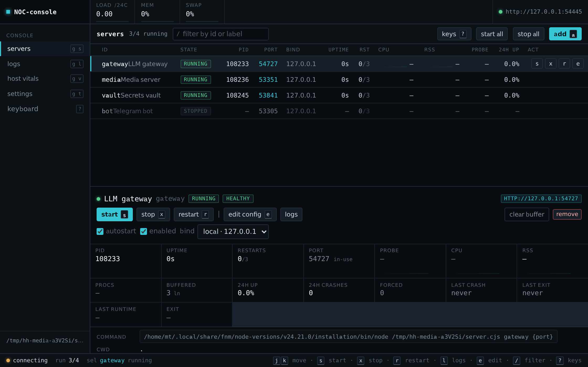

<div align="center">

# 🏠 home-hosted

**The control panel for everything you self-host at home.**

<sub>The harness for your servers.</sub>

Point it at the things you run — a gateway, a media server, a bot, a database — and it starts
them, watches them, restarts what dies, and shows you one page of what is going on. Or
[BYOU](#-bring-your-own-ui-byou), for a specialized UI that fits you exactly.

[](https://www.npmjs.com/package/home-hosted)
[](https://www.npmjs.com/package/home-hosted)
[](https://github.com/NamesMT/home-hosted/actions/workflows/quickcheck.yml)
[](./LICENSE)
[](https://nodejs.org)

[🚀 Quick start](#-quick-start) · [🤖 Agents & API](#-agents-scripts-and-tools) · [✨ Features](#-features) · [🧩 Servers](./SERVERS.md) · [🛠 CLI](#-cli) · [🔔 Notifications](./NOTIFICATIONS.md) · [🎨 BYOU](#-bring-your-own-ui-byou)

</div>

---

<div align="center">



<sub>The stock panel, the [NOC-console](./uis/noc-console) that ships alongside it (for TUI and
shortcuts wizards), and UI directions you could build yourself —
<a href="#-bring-your-own-ui-byou">BYOU</a>.</sub>

</div>

---

## ⚡ Quick start

```bash
npx home-hosted            # start it — detached, it stays running
npx home-hosted status     # where is it, is it healthy
```

That is it. The panel is on **<http://127.0.0.1:3999>** and keeps running after the terminal
closes. <sub>Needs Node 24 or newer.</sub> Stop it whenever you like:

```bash
npx home-hosted down       # stops the panel *and* everything it started
```

> [!NOTE]
> The first boot writes a default password (`hh`) so the panel is never unprotected. Change
> it under **Settings → Authentication** — binding beyond `127.0.0.1` stays refused until you do.

<details>
<summary><b>📦 Install it instead of npx-ing it</b></summary>

```bash
npm install -g home-hosted
home-hosted up
```

Everything it owns — config, secrets, logs, TLS, backups — lives in `$HHOSTED_HOME`, default
`~/.home-hosted`. Delete that and nothing of yours is left behind.

</details>

<details>
<summary><b>📁 Keep a whole setup in a project you can take anywhere</b></summary>

Install the servers next to `home-hosted` and commit the project — it *is* the setup:

```bash
mkdir my-servers && cd my-servers
npm init -y
npm install home-hosted 9router                    # the lockfile pins them, so `npm ci` reproduces

npx home-hosted up --home ./state                  # state lives inside the project
```

```jsonc
// package.json
{
  "scripts": {
    "up": "home-hosted up --home ./state",
    "down": "home-hosted down --home ./state",
    "status": "home-hosted status --home ./state"
  }
}
```

```gitignore
state/*                       # secrets, logs, TLS keys and archives stay local…
!state/servers.config.json    # …but the server definitions are committed
```

One clone, `npm ci`, `npm run up`, and the setup is up on any machine with Node. A worked example,
including per-server data directories inside the project: **[hhosted-9router-dsh](https://github.com/NamesMT/hhosted-9router-dsh)**
(a 9router gateway + dsh harness demo).

<sub>Call them as `npm run up` — `npm up` is npm's own update, not your script.</sub>

</details>

<details>
<summary><b>🧰 Run it under systemd or Docker (no daemon needed)</b></summary>

```bash
home-hosted up --foreground     # stays in the foreground, logs to stderr
```

```ini
[Unit]
Description=home-hosted
[Service]
ExecStart=/usr/local/bin/home-hosted up --foreground
Environment=HHOSTED_HOME=/srv/home-hosted
Restart=always
[Install]
WantedBy=multi-user.target
```

</details>

---

## 🤖 Agents, scripts and tools

The panel is a client of its own API, and the API takes a **long-lived token** as happily as a
browser cookie. That makes home-hosted a natural tool for a coding agent or a shell script: one
command to get a credential, then plain HTTP to start, stop, inspect, restart and read logs.

```bash
home-hosted set-token --generate
#   hh_9uA2…                     (printed once; only its hash is kept, mode 0600)

curl -H "Authorization: Bearer hh_9uA2…" http://127.0.0.1:3999/api/state
curl -H "Authorization: Bearer hh_9uA2…" -X POST http://127.0.0.1:3999/api/servers/9router/restart
curl -N -H "Authorization: Bearer hh_9uA2…" 'http://127.0.0.1:3999/api/events?logs=1'   # SSE
home-hosted status --json        # machine-readable: pid, url, health, paths
```

A token is a first-class credential with the same authority as a signed-in browser, it survives
restarts, and `home-hosted set-token --clear` revokes it instantly. `cookieSecure`/`trustProxy` in
**Settings → Authentication** decide how it behaves behind a proxy.

<details>
<summary><b>🌐 The endpoints worth knowing</b></summary>

| | |
| --- | --- |
| `GET /api/state` | the full snapshot: config, live status, host vitals |
| `GET /api/events` | SSE: the live state, plus logs (`?logs=0`, `?serverId=…`) |
| `GET /api/servers/:id/stream` | SSE: one server's state and logs |
| `POST /api/servers/:id/{start,stop,restart}` | lifecycle |
| `POST /api/servers/:id/free-port` | ask whatever holds that server's port to stop |
| `PATCH /api/servers/:id`, `PATCH /api/settings` | edit configuration |
| `GET /api/logs`, `/api/backups`, `/api/notifications` | logs, archives, Telegram |
| `GET /healthz` | no session needed — the one an external monitor wants (its per-server detail needs a credential) |
| `GET /api/metrics` | Prometheus text |

`GET /openapi/spec.json` describes all of it, `/openapi/ui` is the browsable version, and every error
comes back as one envelope (`{ message, code, detail }`) with a stable `code` a tool can branch on.

</details>

<details>
<summary><b>🧑‍💻 Pointing an agent at it</b></summary>

Give the agent four things and it can run your home server without guessing:

1. the token (`home-hosted set-token --generate`),
2. `http://127.0.0.1:3999/openapi/spec.json` — the API it may call,
3. `home-hosted status --json` — where things are,
4. [SERVERS.md](./SERVERS.md) — how an entry is declared when it needs a new server.

For a UI rather than the API, [UI_CREATION.md](./UI_CREATION.md) is the whole contract, and the panel
can be told what to be: *"Help me build a UI for home-hosted: nostalgic game theme, including …"*.

</details>

---

## ✨ Features

| | |
| --- | --- |
| 🚦 **Lifecycle** | Start, stop, restart from the panel or the API; `autostart` entries come up with it. |
| ♻️ **Auto-restart** | Exponential backoff on crash, with the counter reset once a process stays up. |
| 🩺 **Health that acts** | TCP or HTTP probes per server: warn on the card, force a restart after a timeout, check ports before starting — and follow a program that [restarts itself](./SERVERS.md#adopting-a-self-restarting-program). |
| 🔗 **Ordered startup** | `dependsOn` waits for a dependency to be *healthy* — not merely spawned — and stops in reverse. |
| 📜 **Logs** | Live per-server stream, buffer plus rotated files on disk, search, download, one click to clear. |
| 📈 **Resources** | CPU and RSS of the whole process tree, with an optional memory ceiling that triggers a restart. |
| 🌡️ **Host vitals** | Load, memory, swap, disk and CPU temperature, with thresholds that notify once and again on recovery. |
| 🤖 **Token API** | Scripts and agents drive it with `Authorization: Bearer` — no browser, no session. [↑](#-agents-scripts-and-tools) |
| 🔔 **Notifications** | Telegram on crash, unhealthy, forced restart, recovery and host thresholds — [setup here](./NOTIFICATIONS.md). |
| 💾 **Backups** | One click for config, secrets, TLS and your declared data directories — plain `.zip`, or AES-256 with a password, restored per path. |
| 🎨 **BYOU — Bring Your Own UI** | Upload a static build, `home-hosted ui-revert` to go back. [UI_CREATION.md](./UI_CREATION.md) |
| 🔐 **Security** | Cookie sessions, API tokens, scrypt hashes, per-IP lockout, optional TLS, and a refusal to expose itself without a password. |
| 🧩 **Server-agnostic** | `command` + `args` + `env` + `cwd`. Nothing in the code knows what you run. |
| 🖥 **Cross-platform** | Linux, macOS and Windows: `/proc`, `ps` or Win32_Process, process groups or `taskkill /T`, no shell dependencies. |

---

## 🧩 Servers

An entry is a few lines. Add one with **➕ Add server**, or write it into `servers.config.json`:

```json
{
  "id": "myapp",
  "command": "node",
  "args": ["server.js"],
  "port": 8080,
  "autostart": true,
  "dataEnvs": { "DATA_DIR": "{projectDir}/data/myapp" }
}
```

`dataEnvs` declares a data directory once: it is exported to the process *and* picked up by Backups.
**Every field, every placeholder, the port-conflict policies (including adopting a server that
restarts itself), and how hand-edits are validated: [SERVERS.md](./SERVERS.md).**

---

## 🛠 CLI

| command | |
| --- | --- |
| `home-hosted up` | start the panel detached, and keep it alive in the background |
| `home-hosted down` | stop it cleanly — supervised processes included |
| `home-hosted restart` | `down`, then `up` |
| `home-hosted status` | pid, URL, health, uptime, state and log paths (`--json` for scripts) |
| `home-hosted set-password` | set the panel password without opening a browser |
| `home-hosted set-token` | set the API token scripts and agents use (`--generate`, `--clear`) |
| `home-hosted migrate` | bring `servers.config.json` up to this release's schema (`--dry-run`, `--yes`) |
| `home-hosted ui-revert` | go back to the stock panel UI after uploading your own |

<details>
<summary><b>⚙️ Flags</b></summary>

```text
-c, --config <file>   servers config (default: <state>/servers.config.json)
-p, --port <port>     control panel port (default: 3999)
    --host <bind>     local | lan | an ipv4 address
    --open            open the panel in a browser once it is up
    --no-autostart    do not start the entries marked autostart
    --foreground      run in this process instead of detaching
    --print-config    print the effective config and exit
    --home <dir>      state directory         (or $HHOSTED_HOME)
    --project <dir>   base for relative paths (or $HHOSTED_PROJECT)
```

</details>

<details>
<summary><b>🧭 Upgrading, and why the panel sometimes refuses to start</b></summary>

`servers.config.json` records what wrote it: `meta.writtenBy` (the release) and `meta.schema` (the
config shape). That buys two guarantees:

- **A newer home-hosted always reads an older config** — every existing key keeps its meaning.
- **Keys a newer release added are ignored, not fatal.** The panel names them in its log, leaves them
  in the file, and never resets the settings around them.

What it will not do is run a config it cannot read. A wrong value, a duplicate id, an unreadable file
or a config whose schema is newer than the running release stops `up` with the exact problem, rather
than starting with defaults that quietly differ from your file. Fix the file, or install the release
that wrote it.

When a release changes the shape itself, `home-hosted migrate` applies the steps it ships:

```bash
home-hosted migrate --dry-run   # print the steps, write nothing
home-hosted migrate             # ask, then write — keeps servers.config.json.bak
```

Unattended, consent comes from `--yes` or `HHOSTED_MIGRATE=allow`; without it the command stops.

</details>

---

## 🔐 Security

Everything binds `127.0.0.1` until you say otherwise.

- **A password is required to expose the panel.** Replace the default, then bind to `lan` — in the
  UI, in the config, or with `--host lan`. The same guard applies in all three places.
- **Sessions** live in memory only; the cookie is `HttpOnly` and `SameSite=Strict`, and the login
  route locks out repeated failures per IP.
- **API tokens** let a script or an agent drive the panel without the password:
  `home-hosted set-token --generate` prints one once, and a request proves itself with
  `Authorization: Bearer …`. It is stored as a SHA-256 hash, holds the same access as a signed-in
  browser, works without restarting the panel, and `set-token --clear` revokes it instantly.
- **Port conflicts** are named — `port 4010 is already in use (pid 4242)` — and can be resolved from
  a confirmation popover on that banner or card. The process is looked up again at that moment,
  never taken from the message, and anything the panel supervises is refused, not killed. A server
  that [restarts itself](./SERVERS.md#adopting-a-self-restarting-program) can be followed instead.
- **Secrets never enter the config**: the password hash, the API token hash, the Telegram bot token
  and the TLS key live in `$HHOSTED_HOME/.control-secrets.json` with mode `0600`.
- **Behind a proxy** turn on `trustProxy` and let `cookieSecure: auto` add `Secure` on https, or
  upload a PEM pair and let home-hosted terminate TLS itself.

---

## 🔔 Notifications

Telegram, when something happens while you are not looking: a server that gave up restarting, a
failing health check, a forced restart, a recovery, or a host threshold (disk, memory, swap, load,
temperature). Opt-in, rate-limited per server *and* reason, and the bot token stays in the secrets
file. **Two minutes of setup: [NOTIFICATIONS.md](./NOTIFICATIONS.md).**

---

## 💾 Backups

**Settings → Backups** archives the config, secrets, TLS pair and every data directory your entries
declare — an ordinary `.zip`, or WinZip AES-256 with a password, restored per path.

<details>
<summary><b>🚚 One archive is a whole setup</b></summary>

Start a **blank** home-hosted anywhere — another machine, another user, a fresh container — upload the
archive and restore. Definitions come back, data lands where *this* machine's config says, and
`autostart` entries come up immediately.

It works because an archive carries its own `servers.config.json` and paths are matched by the
**declaration** (`9router:DATA_DIR`), not by an absolute path from the source machine. A restore never
writes where no config declares.

</details>

---

## 🎨 Bring your own UI (BYOU)

The panel is a static site: `$HHOSTED_HOME/.ui` overrides the packaged one, and **Settings →
Interface** takes a zip. No restart, no fork — and `home-hosted ui-revert` brings back the stock
panel if yours breaks.

Two ship in this repo: `uis/stock`, and `uis/noc-console` for TUI and shortcuts wizards; a release
attaches both as `home-hosted-ui-<name>.zip`. Yours can be anything that compiles to static files —
the server never cares what built it.

<details>
<summary><b>🤖 Or have an agent build the UI you actually want</b></summary>

The whole contract fits in one file, so a coding agent can do this. Point it at this repo and be
specific:

> Help me build a UI for `home-hosted`: nostalgic game theme, including … features.

[UI_CREATION.md](./UI_CREATION.md) has the endpoints, the SSE frames, the auth rules and a checklist.

</details>

---

## ❓ FAQ

<details>
<summary><b>Is it a systemd replacement?</b></summary>

No — it is a friendlier layer for the handful of things you run yourself. Keep systemd for the
panel itself (`--foreground`) and for system services; use home-hosted for the rest.

</details>

<details>
<summary><b>What happens to my servers when the panel stops?</b></summary>

`home-hosted down` stops them — that is the point of the command. `SIGTERM`/`SIGINT` are handled
the same way: every supervised process tree is stopped before the panel exits.

</details>

<details>
<summary><b>Nothing starts and the port is busy</b></summary>

A supervised server whose port is taken is reported rather than started over — the panel names the
holder and offers to free it, and a program that restarts itself can be adopted instead
([SERVERS.md](./SERVERS.md#a-busy-port)). The control port itself is checked before the listener is
opened.

</details>

<details>
<summary><b>Where is my state?</b></summary>

`$HHOSTED_HOME`, default `~/.home-hosted`:

```text
servers.config.json      your servers, plus meta: which release and schema wrote it
servers.config.schema.json  regenerated on every start, for editor autocomplete
.control-secrets.json    password hash + API token hash + Telegram token (mode 0600)
.logs/                   rotated per-server logs + history
.tls/                    an uploaded PEM pair
.backups/                zip archives
run.json                 the running panel (pid, url, token, mode 0600)
```

`home-hosted status` prints the paths.

</details>

<details>
<summary><b>Which ports does it use?</b></summary>

Just the control panel, `3999` by default. Supervised servers use the ports you give them.

</details>

<details>
<summary><b>Windows support, really?</b></summary>

Yes. Process trees are sampled from Win32_Process, termination uses `taskkill /T`, and the shipped
examples avoid POSIX-only commands. CPU temperature and swap are best-effort where the OS does not
expose them to an unprivileged process, and adopting a self-restarted process is Linux/macOS only.

</details>

---

## 🗂 Working on it

```text
src/            control plane: config, supervisor, API, providers, services
src/cli.ts      the command line (up/down/status/restart/set-password/set-token/migrate)
src/index.ts    the control plane itself, used by `up --foreground`
uis/            UIs: `stock` (shipped) and alternatives — any framework, static output
bin/            the published entry point
```

`pnpm dev` runs the panel with `tsx watch` plus the stock UI's dev server (state goes to
`.dev-state/`); `pnpm build` produces `dist/` and `uis/stock/dist/`; `pnpm quickcheck` is lint plus
types; `pnpm test` is vitest; `pnpm run media` regenerates the GIF above.

<details>
<summary><b>📚 The docs, and which one you want</b></summary>

| file | for |
| --- | --- |
| [SERVERS.md](./SERVERS.md) | declaring a server: every field, placeholders, port conflicts |
| [NOTIFICATIONS.md](./NOTIFICATIONS.md) | Telegram alerts, end to end |
| [UI_CREATION.md](./UI_CREATION.md) | building a UI against the API |
| [AGENTS.md](./AGENTS.md) | the architecture and the rules worth knowing before changing anything |
| [/openapi/ui](http://127.0.0.1:3999/openapi/ui) | the live API, on your own panel |

</details>

---

<div align="center">

**MIT**

</div>
