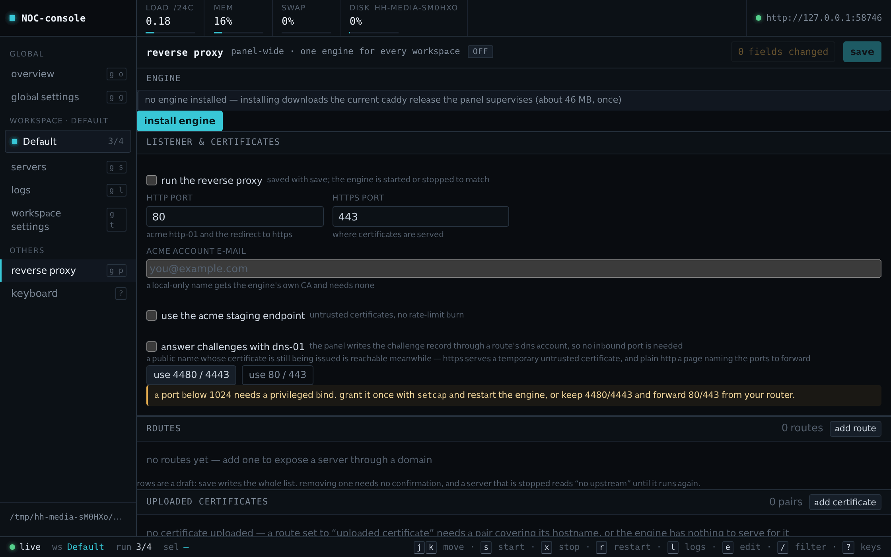

<div align="center">

# 🏠 home-hosted

**The control panel for everything you self-host at home.**

<sub>The harness for your servers.</sub>

Point it at the things you run — a gateway, a media server, a bot, a database — and it starts
them, watches them, restarts what dies, and shows you one page of what is going on. Split them into
[workspaces](#-workspaces) when one panel holds more than one setup. And
[BYOU](#-bring-your-own-ui-byou), for a specialized UI that fits you exactly.

[](https://www.npmjs.com/package/home-hosted)
[](https://www.npmjs.com/package/home-hosted)
[](https://github.com/NamesMT/home-hosted/actions/workflows/quickcheck.yml)
[](./LICENSE)
[](https://nodejs.org)

[🚀 Quick start](#-quick-start) · [🗂 Workspaces](#-workspaces) · [🧩 Servers](./docs/SERVERS.md) · [🤖 Agents & API](#-agents-scripts-and-tools) · [✨ Features](#-features) · [🛠 CLI](#-cli) · [🔔 Notifications](./docs/NOTIFICATIONS.md) · [🔀 Reverse proxy](./docs/REVERSE_PROXY.md) · [🎨 BYOU](#-bring-your-own-ui-byou)

</div>

---

<div align="center">



<sub>The stock panel, the [NOC-console](./uis/noc-console) that ships alongside it (for TUI and
shortcuts wizards), and UI directions you could build yourself —
<a href="#-bring-your-own-ui-byou">BYOU</a>.</sub>

</div>

---

## 🤔 Why?

You run a handful of services at home. The usual choices are extremes — 🧟 `tmux` sessions you
forget about, 📜 a hand-written systemd unit per service (times six), or 🐳 a whole docker/k8s
stack??? - too extreme! — plus 😩 monitoring, rebooting and changing the host machine, yuck!

🙂✨ home-hosted enhances on top: a panel/supervisor that starts them, watches them, restarts what
dies, and puts the whole stack on one page, with deep backup support — whether a server is a plain
command or a `docker compose` stack.

```text
                   ┌──────────────────────────────────────┐
   your browser ──▶│  home-hosted  ·  127.0.0.1:3999      │
                   │  your UI + JSON API + SSE logs       │
                   └───────────────┬──────────────────────┘
                                   │  supervises
        ┌──────────────────────────┼──────────────────────────┐
        ▼                          ▼                          ▼
   ┌─────────┐               ┌─────────┐                ┌─────────┐
   │ gateway │               │ files   │                │ bot     │
   │ :4000   │               │ :4010   │                │  ...    │
   └────┬────┘               └─────────┘                └─────────┘
        │ compose up -d
        ▼
   ┌────────────┬────────────┬────────────┐
   │  gateway   │  postgres  │   redis    │          restarts ↻
   └────────────┴────────────┴────────────┘
     health ✓ (the published port is the probe)
```

|  |  |
| --- | --- |
| ❌ **"Is it still running?"** | Health, CPU/mem, uptime and live logs per server — no `ps`, no `curl`, no hope |
| ❌ **Silent deaths** | Restarted automatically, and the panel or Telegram notifies |
| ❌ **Fragile reboots** | `autostart` brings the stack back; one `down` stops it all cleanly |
| ❌ **"Move it to the new box"** | One archive: config **and** data, restored on a blank host |
| ✅ **home-hosted** | Declare it once, watch it forever, one command to stop it all |

It ships with **nothing**: no blessed paths, no opinion about what you run — a server is a command,
some arguments, and the environment you give it:

```json
{ "id": "gateway", "command": "node", "args": ["server.js"], "port": 4000, "autostart": true }
```

<sub>Manage them from the panel, `home-hosted start|stop <id>` from a shell, `home-hosted status --json`,
or `GET /api/state`; `GET /healthz` is the same status line for your own monitor, no session needed.</sub>

---

## ⚡ Quick start

```bash
npx home-hosted            # start it — detached, it stays running
npx home-hosted status     # where is it, is it healthy
# pnpm instead of npx: `pnpm dlx home-hosted …`
```

That is it. The panel is on **<http://127.0.0.1:3999>** and keeps running after the terminal
closes. <sub>Needs Node 24 or newer.</sub> Stop it whenever you like:

```bash
npx home-hosted down       # stops the panel *and* everything it started
```

> [!NOTE]
> The first boot writes a default password (`hh`) so the panel is never unprotected. Change
> it under **Global settings → Authentication** — binding beyond `127.0.0.1` stays refused until you do.

<details>
<summary><b>📦 Install it instead of npx-ing it</b></summary>

```bash
npm install -g home-hosted      # or: pnpm add -g home-hosted
home-hosted up                  # `hh up` does the same
```

Everything it owns — workspaces, settings, secrets, logs, TLS, backups — lives under
`$HHOSTED_HOME/.hh`, default `~/.home-hosted/.hh`. Delete that and nothing of yours is left behind.

<sub>An installed home-hosted answers to **`hh`** too — `hh up`, `hh status`, `hh down`. Only the
installed form gets it; npx stays `npx home-hosted …`.</sub>

</details>

<details>
<summary><b>📁 Keep a whole setup in a project you can take anywhere</b></summary>

Commit the project and it *is* the setup. `init` scaffolds it:

```bash
npx home-hosted init            # or: pnpm dlx home-hosted init
#   project directory, package name, package manager, install, git — every step has a default
#   `--yes` takes them all, for an agent or a CI job
```

It writes a manifest whose scripts all pass `--home ./state`:

```jsonc
// package.json
{
  "scripts": {
    "up": "home-hosted up --home ./state",
    "down": "home-hosted down --home ./state",
    "status": "home-hosted status --home ./state"
    // …and restart, set-password, set-token, migrate
  }
}
```

```gitignore
node_modules/
state/.hh/*                             # secrets, logs, TLS keys and archives stay local…
!state/.hh/settings.json                 # …but the workspace definitions are committed
!state/.hh/workspaces.json
state/.hh/*/*
!state/.hh/*/settings.json
!state/.hh/*/servers.config.json
data/                                   # per-server data directories, declared through dataEnvs
```

One clone, `pnpm install --frozen-lockfile`, `pnpm run up` — the setup is up on any machine with Node.
Worked example, with per-server data inside the project:
**[hhosted-ai-pack](https://github.com/NamesMT/hhosted-ai-pack)**.

<sub>Call them as `pnpm run up` — `pnpm up` is pnpm's own update, not your script.</sub>

> [!TIP]
> Recommended to give a project its own panel port (`control.port`, e.g. `4399`), to avoid port conflict
> with other projects.

</details>

<details>
<summary><b>🧰 Run it under systemd or Docker</b></summary>

```bash
home-hosted up --foreground     # stays in the foreground, logs to stderr
```

```ini
[Unit]
Description=home-hosted
[Service]
User=$YOUR_USER
ExecStart=/usr/local/bin/home-hosted up --foreground
Environment=HHOSTED_HOME=/srv/home-hosted
Restart=always
[Install]
WantedBy=multi-user.target
```
> [!CAUTION]
> Note: change `$YOUR_USER` to your actual user account, or remove for `root`.
> You could also change `/srv/home-hosted` to change where the data stores.

</details>

---

## 🤖 Agents, scripts and tools

Everything the panel does, a script or an agent can do: the API takes a **long-lived token** in place
of the browser cookie. One command for a credential, then plain HTTP to start, stop, inspect, restart
and read logs.

```bash
home-hosted set-token --generate
#   hh_9uA2…                     (printed once; only its hash is kept, mode 0600)

curl -H "Authorization: Bearer hh_9uA2…" http://127.0.0.1:3999/api/state
curl -H "Authorization: Bearer hh_9uA2…" -X POST 'http://127.0.0.1:3999/api/servers/omniroute/restart?workspace=default'
curl -N -H "Authorization: Bearer hh_9uA2…" 'http://127.0.0.1:3999/api/servers/omniroute/stream?workspace=default'   # SSE
home-hosted status --json        # machine-readable: pid, url, health, paths
```

A token has the same authority as a signed-in browser and outlives restarts; `set-token --clear`
revokes it instantly. Workspace-scoped routes take `?workspace=<id>`; omitting it means the panel's
default workspace.

<details>
<summary><b>🌐 The endpoints worth knowing</b></summary>

| | | `?workspace` |
| --- | --- | --- |
| `GET /api/state` | the full snapshot: global settings, every workspace with its servers, host vitals | ❌ |
| `GET`/`POST /api/workspaces`, `PATCH`/`DELETE /api/workspaces/:id` | the registry: list, create, rename, remove | ❌ |
| `GET /api/events` | SSE: the live state, plus logs (`?logs=0`, `?serverId=…`; a `server` payload carries its `workspaceId`) | ❌ |
| `GET`/`POST /api/servers`, `POST /api/servers/{start,stop}-all` | that workspace's entries, and its lifecycle for all of them | ✅ |
| `GET`/`PATCH`/`DELETE /api/servers/:id` | one entry | ✅ |
| `POST /api/servers/:id/{start,stop,restart}`, `POST /api/servers/:id/free-port` | one entry's lifecycle, and freeing its port | ✅ |
| `GET /api/servers/:id/logs`, `GET /api/servers/:id/stream` | that entry's buffered lines, and its SSE | ✅ |
| `GET /api/logs` | persisted history and files | ✅ |
| `GET`/`PUT /api/ddns`, `/api/ddns/credentials/:id`, `/api/ddns/check` | that workspace's Dynamic DNS policy, credentials and a check | ✅ |
| `PUT`/`DELETE /api/notifications/token`, `POST /api/notifications/{test,detect-chats}` | that workspace's bot credential and a test send | ✅ |
| `GET`/`PATCH /api/settings/workspace` | server defaults, logs, notifications | ✅ |
| `GET`/`PATCH /api/settings` | panel-wide: listener, authentication, TLS, host vitals, backups | ❌ |
| `GET`/`POST /api/backups`, restore | archives | ❌ |
| `GET`/`PATCH /api/proxy`, `POST /api/proxy/{engine,start,stop,apply,revert}`, `PUT`/`DELETE /api/proxy/certificates/:id` | the reverse proxy: its engine, its route table, and its uploaded certificates | ❌ |
| `GET /healthz` | no session needed — the one an external monitor wants (its per-server detail needs a credential) | ❌ |
| `GET /api/metrics` | Prometheus text (needs a token or session, like every `/api` route) | ❌ |

✅ takes `?workspace=<id>`; ❌ is panel-wide. Omitting `?workspace` means `default` workspace is used.

`GET /openapi/spec.json` describes all of it, `/openapi/ui` is the browsable version, and every error
comes back as one envelope (`{ message, code, detail }`) with a stable `code` a tool can branch on.

</details>

<details>
<summary><b>🧑‍💻 Pointing an agent at it</b></summary>

Give the agent four things and it can run your home server without guessing:

1. the token (`home-hosted set-token --generate`),
2. `http://127.0.0.1:3999/openapi/spec.json` — the API it may call,
3. `home-hosted status --json` — where things are,
4. [SERVERS.md](./docs/SERVERS.md) — how an entry is declared when it needs a new server.

For a UI rather than the API, [UI_CREATION.md](./docs/UI_CREATION.md) is the whole contract, and the panel
can be told what to be: *"Help me build a UI for home-hosted: nostalgic game theme, including …"*.

</details>

---

## ✨ Features

| | |
| --- | --- |
| 🗂 **Workspaces** | One panel, many scopes: pick a workspace in the header and it owns its servers, secrets, logs and settings. Create, rename and delete them there. Panel-wide things — listener, auth, host vitals, backups, TLS, UI — stay in **Global settings**. |
| 🚦 **Lifecycle** | Start, stop, restart from the panel or the API; `autostart` entries come up with it. |
| 📝 **Hand edits welcome** | Change a workspace's `servers.config.json` in an editor, a `git checkout` or a config tool: the panel notices within seconds, no restart. A file it cannot read is reported in the panel, and the running servers are left alone. |
| ♻️ **Auto-restart** | Exponential backoff on crash, with the counter reset once a process stays up. |
| 🩺 **Health that acts** | TCP or HTTP probes per server: warn on the card, force a restart after a timeout, check ports before starting — and [follow or replace](./docs/SERVERS.md#when-a-program-restarts-itself) a program that restarts itself. |
| 🔗 **Ordered startup** | `dependsOn` waits for a dependency to be *healthy* — not merely spawned — and stops in reverse. |
| 📜 **Logs** | Live per-server stream, buffer plus rotated files on disk, search, filter to one stream, download, one click to clear. |
| 📈 **Resources** | CPU and RSS of the whole process tree, with an optional memory ceiling that triggers a restart. |
| 🌡️ **Host vitals** | Load, memory, swap, disk and CPU temperature, with thresholds that notify once and again on recovery. |
| 🤖 **Token API** | Scripts and agents drive it with `Authorization: Bearer` — no browser, no session. [↑](#-agents-scripts-and-tools) |
| 🔔 **Notifications** | Telegram on crash, unhealthy, forced restart, recovery, host thresholds and DNS changes — [setup here](./docs/NOTIFICATIONS.md). |
| 🌐 **Dynamic DNS** | Keep hostnames pointed at your public IP — Cloudflare, Namecheap, Spaceship, Porkbun, GoDaddy, Gandi and more. [DDNS.md](./docs/DDNS.md) |
| 🔀 **Reverse proxy** | One engine in front of everything, with automatic HTTPS: `git.example.com` → a Gitea entry, `media.example.com` → a service on another box, `panel.example.com` → the panel. Caddy, installed and supervised by the panel. [REVERSE_PROXY.md](./docs/REVERSE_PROXY.md) |
| 💾 **Backups** | Deep and customizable: pick global settings, global secrets, TLS, Workspaces, then the pieces inside it (workspace settings, servers, secrets, data directories) — plain `.zip`, or AES-256 with a password, customized restore is supported too! |
| 🎨 **BYOU — Bring Your Own UI** | Upload a static build, `ui-update` to follow its releases, `ui-revert` to go back. [UI_CREATION.md](./docs/UI_CREATION.md) |
| 🔐 **Security** | Cookie sessions, API tokens, scrypt hashes, per-IP lockout, optional TLS, and a refusal to expose itself without a password. |
| 🧩 **No special treatment** | A server is `command` + `args` + `env` + `cwd`; nothing is built in for any particular app. |
| 🖥 **Cross-platform** | Linux, macOS and Windows: `/proc`, `ps` or Win32_Process, process groups or `taskkill /T`, no shell dependencies. |

---

## 🗂 Workspaces

A workspace is the ownership boundary: its own servers, secrets, logs, states and settings.
The first boot creates a `default` workspace.

| page | url | scope |
| --- | --- | --- |
| **Overview** | `/w/<workspace>` | the selected workspace: its servers, counts and live status |
| **Servers** · **Logs** · **Workspace settings** | `/w/<workspace>/servers` · `/w/<workspace>/logs` · `/w/<workspace>/settings` | the selected workspace |
| **One server** | `/w/<workspace>/servers/<id>` | that entry: config, live logs, resources |
| **Global Overview** | `/global/overview` | host vitals plus every server from every workspace |
| **Global settings** | `/global/settings` | Listener, Authentication, Host vitals, Backups, TLS, Interface, Paths |
| **Reverse Proxy** | `/proxy` | panel-wide: one engine, every workspace's servers ([REVERSE_PROXY.md](./docs/REVERSE_PROXY.md)) |

<details>
<summary><b>🗂 What lives where</b></summary>

| | |
| --- | --- |
| global — `$HHOSTED_HOME/.hh/` | `settings.json` (listener, auth, TLS, host vitals, backups), `workspaces.json`, `.control-secrets.json` (password + API token, 0600), `.tls/`, `.ui/`, `.backups/`, `.logs/`, `run.json` |
| workspace — `.hh/<id>/` | `settings.json` (server defaults, logs, notifications, DDNS), `servers.config.json`, `.secrets.json` (Telegram + DDNS credentials, 0600), `.logs/`, `.state/` |

</details>

---

## 🧩 Servers

An entry is a few lines. Add one with **➕ Add server**, or write it into the selected workspace's
`servers.config.json` (`$HHOSTED_HOME/.hh/<workspace>/servers.config.json`):

```json
{
  "id": "myapp",
  "command": "node",
  "args": ["server.js"],
  "port": 8080,
  "autostart": true,
  "dataEnvs": { "DATA_DIR": "{projectDir}/data/myapp" }
}
```

`dataEnvs` declares a data directory once: it is exported to the process *and* picked up by Backups.

**Every field, every placeholder, the port-conflict policies (including adopting a server that
restarts itself), and how hand-edits are validated: [SERVERS.md](./docs/SERVERS.md).**

---

## 🛠 CLI

| command | |
| --- | --- |
| `home-hosted up` | start the panel detached, and keep it alive in the background |
| `home-hosted down` | stop it cleanly — supervised processes included, persistent entries left running |
| `home-hosted restart` | `down`, then `up` — or `restart <id>` to restart one server, leaving the panel up |
| `home-hosted status` | pid, URL, health, uptime, state and log paths — the panel's console *and* the per-server directory, naming the `<id>.log` convention once logs exist (`--json` for scripts; stopped answers `{ running: false, initialised }`, where `initialised: false` means nothing was ever set up here) |
| `home-hosted start <id>` | start one server in the default workspace — and anything it `dependsOn` (`--workspace <id>`) |
| `home-hosted stop <id>` | stop one server, nothing else (`--workspace <id>`) |
| `home-hosted restart <id>` | restart one server, nothing else (`--workspace <id>`) — the same as the panel's per-server Restart |
| `home-hosted logs` | read the panel's own console output — the file `up` redirects it into (`--lines`, `--follow`, `--json`) |
| `home-hosted set-password` | set the panel password without opening a browser |
| `home-hosted set-token` | set the API token scripts and agents use (`--generate`, `--clear`) |
| `home-hosted migrate` | relocate a pre-workspaces state directory and stamp every config for this release (`--dry-run`, `--yes`) |
| `home-hosted init` | scaffold a self-contained project, whose scripts keep state in the repo (`--home ./state`) |
| `home-hosted ui-switch` | install a UI from a release asset, a zip file or a URL (interactive) |
| `home-hosted ui-update` | bring an installed UI up to date automatically (official UI) or pick a release (`--old`, `--check`) |
| `home-hosted ui-revert` | go back to the stock panel UI after uploading your own |

<details>
<summary><b>⚙️ Flags</b></summary>

`home-hosted <command> --help` prints what that command takes.

```text
up                -c/--config -p/--port --host --open --no-autostart --foreground --print-config

down              (no flags)
status            --json
logs              --lines <n> --follow --json
start, stop       <id> [-w/--workspace <id>]   (both need the panel up)
restart           [<id>] [-w/--workspace <id>]  (no id: the panel; with one: that server)
init              --dir --name --pm --no-install -y/--yes
set-password      --clear
set-token         --generate --clear
migrate           --config --dry-run -y/--yes
ui-switch         --repo --tag --asset --file --list --token -y/--yes
ui-update         --check --tag --asset --old --repo --token -y/--yes
ui-revert         (no flags)

every command     --home <dir> --project <dir>       (or $HHOSTED_HOME, $HHOSTED_PROJECT)
env vars          HHOSTED_PASSWORD, HHOSTED_MIGRATE=allow, HHOSTED_TOKEN, GITHUB_TOKEN or GH_TOKEN
```

`up` and `restart` share the same flags: bare `restart` is `down`, then `up` with exactly what it was
given. Given a server id — `restart web` — it restarts only that entry, and the panel keeps running.
`-c/--config` is the **default workspace's** servers file (`<state>/.hh/default/servers.config.json`),
for a launcher that pins one; a workspace picked in the UI keeps its own. `start`/`stop` omit
`--workspace` to act in the panel's default workspace.

A misspelled command or option names the one you meant — `home-hosted restar` answers
`did you mean \`restart\`?`, and `up --prt 4000` answers `did you mean \`--port\`?`. Both stay quiet
when nothing is close, rather than guessing.

</details>

<details>
<summary><b>🧭 Upgrading, and why the panel sometimes refuses to start</b></summary>

```bash
home-hosted migrate --dry-run   # print the steps, write nothing
home-hosted migrate             # ask, then write — keeps a .bak beside each rewritten file
```

Unattended, consent comes from `--yes` or `HHOSTED_MIGRATE=allow`; without it the command stops.

Each config records what wrote it: `meta.writtenBy` (the release) and `meta.schema` (the shape). That
buys two guarantees:

- **A newer home-hosted always reads an older config** — every existing key keeps its meaning.
- **Keys a newer release added are ignored, not fatal.** The panel names them in its log, leaves them
  in the file, and never resets the settings around them.

What it will not do is run a config it cannot read. A wrong value, a duplicate id, an unreadable file
or a config whose schema is newer than the running release stops `up` with the exact problem, rather
than starting with defaults that quietly differ from your file. Fix the file, or install the release
that wrote it.

</details>

---

## 🔐 Security

Everything binds `127.0.0.1` until you say otherwise.

- **A password is required to expose the panel.** Replace the default, then bind to `lan` — in the
  UI, in the config, or with `--host lan`. The same guard applies in all three places.
- **Sessions** live in memory only; the cookie is `HttpOnly` and `SameSite=Strict`, and the login
  route locks out repeated failures per IP — see the `trustProxy` note below for when that is advisory.
- **API tokens** for scripts and agents: `home-hosted set-token --generate` prints one once, and a
  request proves itself with `Authorization: Bearer …` — the same access as a signed-in browser,
  stored as a SHA-256 hash, revoked with `set-token --clear`.
- **Port conflicts** are named — `port 4010 is already in use (pid 4242)` — and can be resolved from
  a confirmation popover on that banner or card. The process is looked up again at that moment,
  never taken from the message, and anything the panel supervises is refused, not killed. A server
  that [restarts itself](./docs/SERVERS.md#when-a-program-restarts-itself) can be followed, or replaced
  with a supervised copy.
- **Secrets never enter the config**: the password hash and API token hash live in the global
  `.hh/.control-secrets.json`, each workspace's Telegram bot token and DDNS credentials in its own
  `.hh/<workspace>/.secrets.json`, all mode `0600`; the TLS pair sits in `.hh/.tls/`. DDNS credentials
  are sealed with AES-256-GCM under `HHOSTED_DDNS_SECRET` (default `hh` — set your own).
- **Behind a proxy** turn on `trustProxy` and let `cookieSecure: auto` add `Secure` on https, or
  upload a PEM pair and let home-hosted terminate TLS itself. Only turn it on when the proxy is the
  only way in: it trusts `x-forwarded-*` from any peer, and the client address then comes from the
  caller's own header — so the per-IP lockout counts per *forged* address and stops throttling brute
  force. Keep the bind on `local` with the proxy on this machine, or put an authenticating gateway in
  front. The panel warns at startup when the combination is exposed.

---

## 🔔 Notifications

Telegram, when something happens while you are not looking: a server that gave up restarting, a
failing health check, a forced restart, a recovery, a host threshold (disk, memory, swap, load,
temperature), or a dynamic DNS change. Opt-in, rate-limited per server *and* reason, and the bot token
stays in the secrets file. **Two minutes of setup: [NOTIFICATIONS.md](./docs/NOTIFICATIONS.md).**

---

## 🌐 Dynamic DNS

**Workspace Settings → Dynamic DNS** keeps a list of hostnames pointed at this machine's public IP —
add an account, paste its credentials, add hostnames. The panel checks the address on an interval and
calls a provider only when it actually changed, and the last confirmed address survives a restart.
Provider tokens stay in the workspace's secrets file. **Providers and the config shape:
[DDNS.md](./docs/DDNS.md).**

---

## 💾 Backups

**Global settings → Backups** archives the panel's own settings, its secrets and the TLS pair — plus
every workspace you pick. It is two-level: the top of *Create backup…* lists the global items and
each workspace; opening a workspace lists its **settings**, **servers**, **secrets** and every data
directory its entries declare, and you can drop any single piece. *Restore…* shows the same list from
an archive before anything is written. Either way it is an ordinary `.zip`, or WinZip AES-256 with a
password, restored per path. Known build output and dependency directories (`node_modules`, `dist`,
`.next`, framework caches) are skipped per entry; `backupIgnoreGenerated: false` captures them anyway.

<details>
<summary><b>🚚 One archive is a whole setup</b></summary>

Start a **blank** home-hosted anywhere — another machine, another user, a fresh container — upload the
archive and restore. Definitions come back, data lands where *this* machine's config says, and
`autostart` entries come up immediately.

It works because an archive carries each workspace's `settings.json` and `servers.config.json`, and
paths are matched by the **declaration** (`omniroute:DATA_DIR`), not by an absolute path from the
source machine. A restore never writes where no config declares. A declaration using `{projectDir}`,
`{dataRoot}` or `{home}` follows the restoring panel (`{projectDir}` is `HHOSTED_PROJECT` or the
panel's cwd, not `HHOSTED_HOME`); a literal absolute path is restored to that same path.

</details>

---

## 🎨 Bring your own UI (BYOU)

The panel is a static site: `$HHOSTED_HOME/.hh/.ui` overrides the packaged one, and **Global
settings → Interface** takes a zip. No restart, no fork — and `home-hosted ui-revert` brings back the
stock panel if yours breaks.

Two ship in this repo: `uis/stock`, and `uis/noc-console` for TUI and shortcuts wizards; a release
attaches both as `home-hosted-ui-<name>.zip`. Yours can be anything that compiles to static files —
the server never cares what built it.

<sub>Install a UI from the CLI: `home-hosted ui-switch` `--asset noc-console` selects an UI directly, no flags interactively show official assets. Official UIs's version auto-sync when you update `home-hosted`. For unofficial UIs, `home-hosted ui-update` offers its newer releases to pick from — or `--old` for older (author must set up `ui.json` and GH releases).</sub>

<details>
<summary><b>🤖 Or have an agent build the UI you actually want</b></summary>

The whole contract fits in one file, so a coding agent can do this. Point it at this repo and be
specific:

> Help me build a UI for `home-hosted`: nostalgic game theme, including … features.

[UI_CREATION.md](./docs/UI_CREATION.md) has the endpoints, the SSE frames, the auth rules and a checklist.

</details>

---

## ❓ FAQ

<details>
<summary><b>The panel is up but something is wrong — where do I look?</b></summary>

`home-hosted logs` prints the panel's own console output, which is where it reports what it is
doing and anything it could not finish:

```bash
home-hosted logs              # the last 50 lines
home-hosted logs --follow     # keep printing, like tail -f
home-hosted logs --lines all  # the whole thing, including the rotation
home-hosted logs --json       # { path, lines } — or one object per line with --follow
```

It is the same file `status` names, and reading it needs no session or API token — a panel that
is answering badly is exactly when you cannot get one. `up` prints the tail automatically when
the panel fails to start.

</details>

<details>
<summary><b>Is it a systemd replacement?</b></summary>

No — it is a friendlier layer for the handful of things you run yourself. Keep systemd for the
panel itself (`--foreground`) and for system services; use home-hosted for the rest.

</details>

<details>
<summary><b>What happens to my servers when the panel stops?</b></summary>

`home-hosted down` stops them — that is the point of the command. `SIGTERM`/`SIGINT` are handled
the same way: every supervised process tree is stopped before the panel exits.

An entry marked `persistent` is the exception, and `down` names it instead of stopping it: it runs
under its own nanny process, keeps logging, and is reattached by the next panel
([SERVERS.md](./docs/SERVERS.md#persistent-entries)).

</details>

<details>
<summary><b>Nothing starts and the port is busy</b></summary>

A supervised server whose port is taken is reported rather than started over — the panel names the
holder and offers to free it, and a program that restarts itself can be followed or reclaimed instead
([SERVERS.md](./docs/SERVERS.md#a-busy-port)). The control port itself is checked before the listener is
opened.

</details>

<details>
<summary><b>Where is my state?</b></summary>

`$HHOSTED_HOME/.hh`, default `~/.home-hosted/.hh`. Global files at the top level, one directory per
workspace:

```text
settings.json                panel-wide: listener, auth, TLS policy, host vitals, backups
workspaces.json              the registry: ids and labels, in selector order
.control-secrets.json        password hash + API token hash (mode 0600)
.tls/                        an uploaded PEM pair
.ui/                         an installed custom UI
.backups/                    zip archives
.logs/                       the panel's own console log
run.json                     the running panel (pid, url, token, mode 0600)

<workspace>/settings.json    server defaults, log retention, notifications, DDNS
<workspace>/servers.config.json  your servers, plus meta: which release and schema wrote it
<workspace>/.secrets.json    Telegram token + DDNS credentials (mode 0600)
<workspace>/.logs/           per-server logs: <id>.log, rotated to <id>.log.1 … (newest first)
<workspace>/.state/          persistent entries' nanny state
```

`home-hosted status` prints the paths.

</details>

<details>
<summary><b>Which ports does it use?</b></summary>

The control panel, `3999` by default. Supervised servers use the ports you give them. The reverse
proxy is the one panel-wide listener, and only when you switch it on: `80`/`443` for automatic HTTPS,
or `4480`/`4443` unprivileged with your router forwarding to them
([REVERSE_PROXY.md](./docs/REVERSE_PROXY.md#ports)).

**If that port is taken, `up` names who holds it** — the pid and the command line, when the OS will
tell it — rather than only reporting the number. A `follow` entry adopts the process that replaced it;
an unrelated listener is never signalled
([SERVERS.md](./docs/SERVERS.md#a-busy-port)).

</details>

<details>
<summary><b>Windows support, really?</b></summary>

Yes. Process trees are sampled from Win32_Process, termination uses `taskkill /T`, and the shipped
examples avoid POSIX-only commands. CPU temperature and swap are best-effort where the OS does not
expose them to an unprivileged process. Adopting a self-restarted process works on Windows too, off
its argv instead of the environment marker; a launcher whose real process is a `.cmd` shim is the one
case it cannot see through, and `kill` is the answer there.

</details>

---

## 🗂 Working on it

```text
src/            control plane: config, supervisor, API, providers, services
src/cli.ts      the command line; one file per command under src/cli/
src/index.ts    the control plane itself, used by `up --foreground`
uis/            UIs: `stock` (shipped in the package) and alternatives — any framework, static output
bin/            the published entry point
docs/           topic docs, UI examples and the README's media
scripts/        builds, typechecks, media capture, release helpers
test/           the vitest suite
```

`pnpm dev` runs the panel with `tsx watch` plus one UI's dev server on the 6xxx range — panel `6000`,
UI `6001` (`pnpm dev --ui noc-console`), state in `.dev-state/` — so a dev instance never fights an
installed panel's 3999. `pnpm build` produces `dist/` and `uis/stock/dist/`; `pnpm quickcheck` is lint
plus types; `pnpm test` is vitest; `pnpm run media` regenerates the GIF above.

<details>
<summary><b>📚 Which doc do I need?</b></summary>

| if you want to… | read |
| --- | --- |
| declare a server: every field, placeholders, port conflicts | [SERVERS.md](./docs/SERVERS.md) |
| get Telegram alerts working end to end | [NOTIFICATIONS.md](./docs/NOTIFICATIONS.md) |
| expose the stack behind one hostname, with HTTPS | [REVERSE_PROXY.md](./docs/REVERSE_PROXY.md) |
| build a UI against the API | [UI_CREATION.md](./docs/UI_CREATION.md) |
| change the internals: architecture and the rules | [AGENTS.md](./AGENTS.md) |
| poke the live API on your own panel | [/openapi/ui](http://127.0.0.1:3999/openapi/ui) |

</details>

---

<details>
<summary><b>🔗 Interesting resources</b></summary>

- [dsh-home-hosted](https://github.com/NamesMT/dsh-home-hosted) — home-hosted servers management with boot autostart from inside [DeepSeek Harness](https://github.com/deepseek-ai/deepseek-harness)

<sub><i>+ PR to add yours</i></sub>

</details>

---

<div align="center">

**MIT**

</div>
